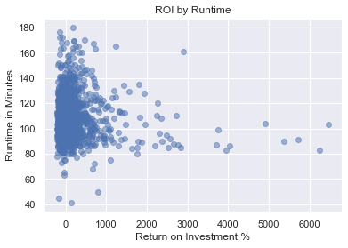
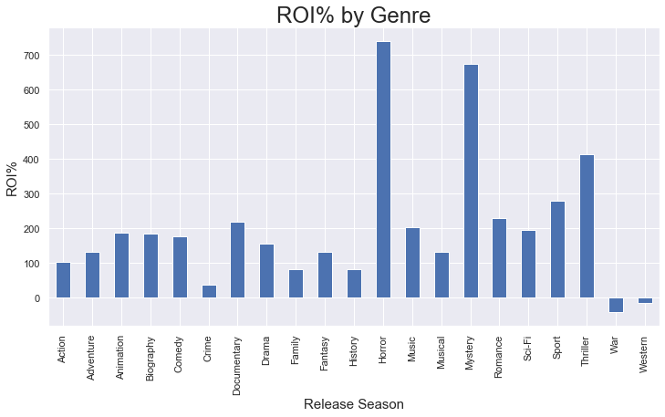
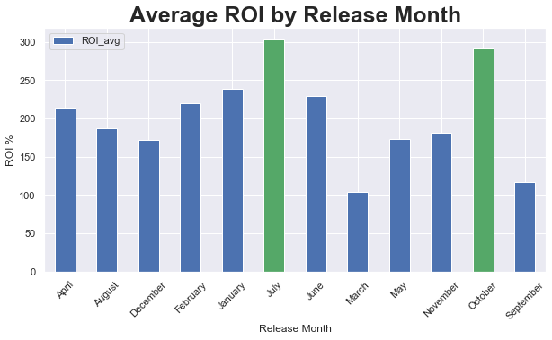
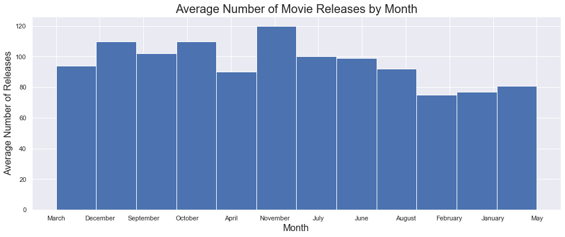

<h1> Movie Analysis for Microsoft </h1>

<h2> Overview </h2>

<p> -- Using data from over 1,000 random movies, we have identified trends from movies with a high return on investment.</p>
<p> -- We chose ROI (Return on Investment) over actual profits, as a better indicator for companies that are newly breaking into the sector. 
Newly starting companies generally begin with a lower budget and rely on ROI to build a solid foundation and to afford maximum reinvest. </p>


<h2> Cleaning the data (merging_dataframes.ipynb) </h2>

<h2> The Three Areas of Analysis </h2>

<p><ul><li>Runtime<li>Genre<li>Month of Release</ul><p>

<h2> Runtime (runtime.ipynb)</h2>

<p>Movies that fall into a certain range of runtimes are more likely to result in a sale. <br/>
When they run outside of these times, consumers may be more hesitant to watch.<p>

<p> According to our data analysis, it shows that movies with runtimes of <b>80-140</b> minutes are most profitable</p>

<p> Notice it does not guarantee a profitable movie, but it does lower the chance of it not being profitable.</p>


<h2> Genre (genre.ipynb)</h2>

<p>Genres describe the movie and what the type of story the consume will be watching.<br/>
There are many genres and more than one can be used to describe a production.</p>

<p> The top genres for return on investment are <b>Horror, Thriller, and Mystery</b> </p>
<p> The worst genres are Western, and War</p>



<h2> Month of Release (season.ipynb)</h2>

<p>Month of release is a factor of season, holidays, weather, and culture and a consumer’s likelihood of watching a movie during that time frame.</p> 


<p> <b> July and October </b> show the highest return on investment. </p>
<p> <b> March and September</b> have an extremely low ROI </p>



<p>The competition of these months is as follows</p>

<p> <b>October, November, and December</b> have the highest number of average releases </p>
<p> <b>January, February, and May</b> have the least number of average releases</p>

<p> <b> *A high rate of return along with low competition is a great combination for a company looking to break into this area.*</b></p>

<h2> Summary of Findings </h2>

<h4>Runtime - </h4> <p>Between 80-140 minutes</p>

<h4>Genres - </h4> 
<p>Horror, Thriller, Mystery</p>
<p> Avoid Western and War</p>

<h4>Release Months -</h4>
<p>July and October</p>
<p>Avoid March and September</p>

<h2> Suggestions </h2>

<ul>
    <li> Stay in between the recommended runtimes, aiming mostly for the middle of the two.</li>
    <li> Create a movie with a combination of the top three genres, so it hits on all three, which will appear inticing to a broader range of consumers.</li>
    <li> Do not release a movie in March or September. It has both very low ROI and higher competition. </li>
    <li> If you are looking to start with a lower budget, I recommend releasing a title in January which has a high ROI and low competition.  </li>
    <li> If you intend to make any combination of horror and are starting with a large budget, schedule the theater release of this movie in October (as you will be more competitive).</li>
</ul>

<h2> Non-Technical Presentation File (ConsultingPresentation.pdf) </h2>


```python

```
